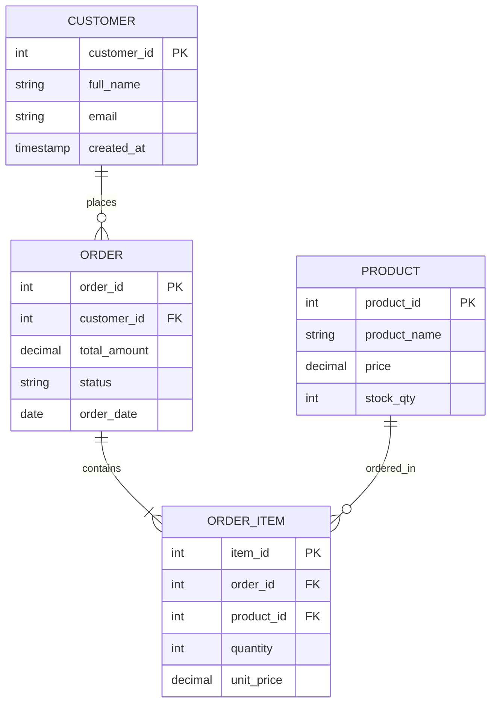
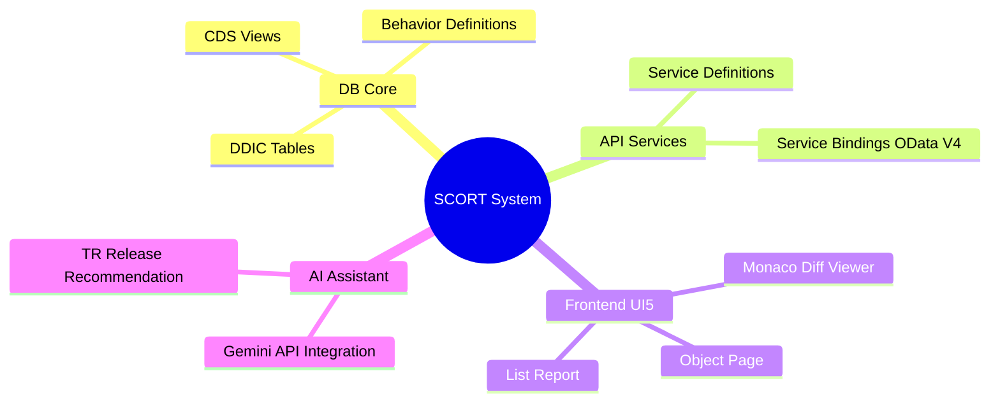
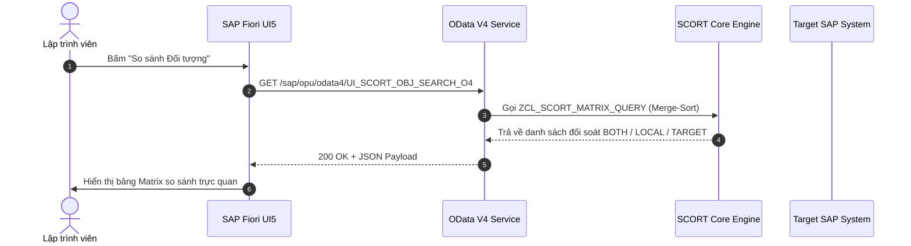
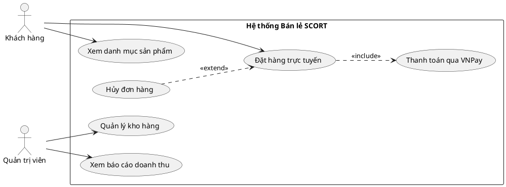
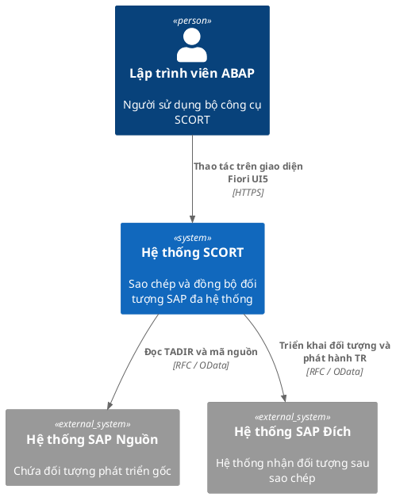
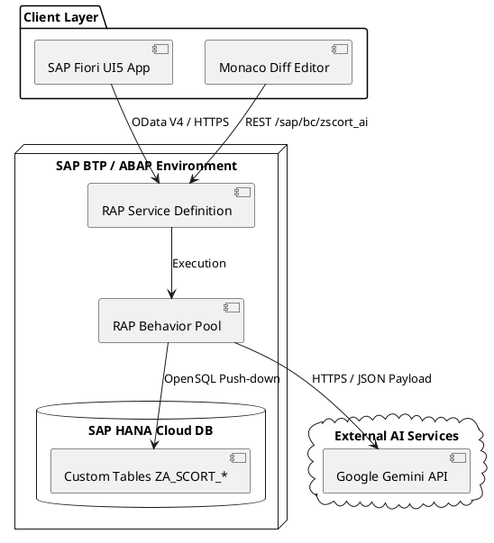
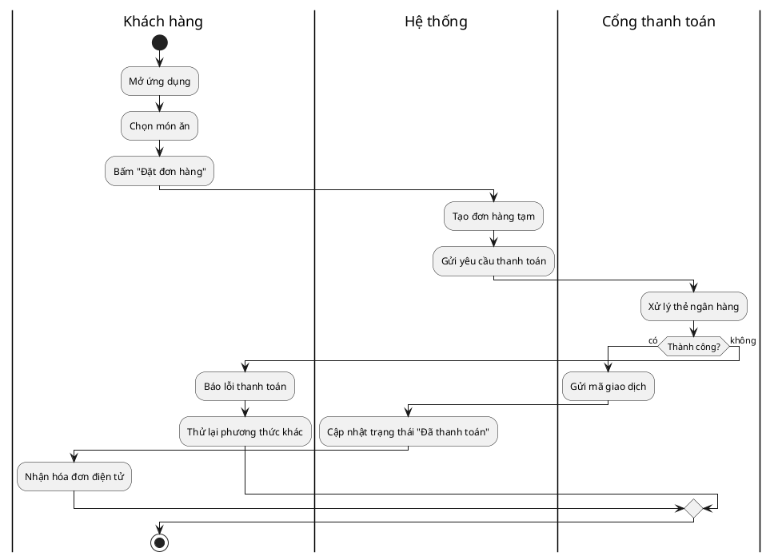
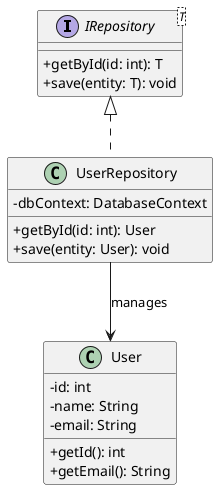
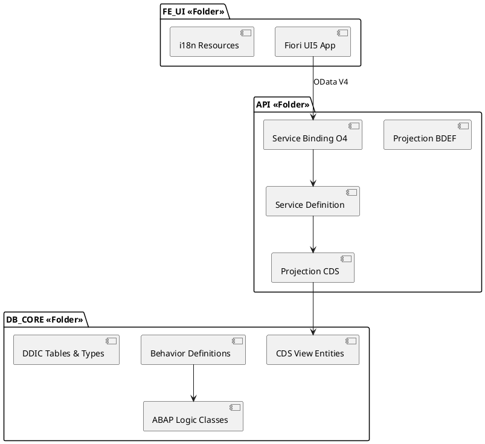

# Antigravity Skill: Technical Diagram Engine (`technical-diagrams`)

Use this skill when designing, generating, rendering, or editing publication-grade technical diagrams, database schemas, system architectures, or mobile application screen flows for DEV/BA documentation, SRS reports, and Word/PDF deliverables.

---

## 🌟 Multi-Engine Architecture & Core Principles

The toolkit adopts a **3-Engine Architecture** unified behind a **Single Source of Truth (JSON Spec)**:

```
                  Unified JSON Spec File (.json)
                                │
         ┌──────────────────────┼──────────────────────┐
         ▼                      ▼                      ▼
  "engine": "canvas"     "engine": "mermaid"    "engine": "plantuml"
         │                      │                      │
  spec_diagram_engine     mermaid_renderer       plantuml_renderer
  (Headless Chromium)       (mmdc CLI)          (Java + plantuml.jar)
         │                      │                      │
         └──────────────────────┼──────────────────────┘
                                ▼
                   PNG High-Res (scale=3 / 300+ DPI)
                                │
                                ▼
               docx_writer.py (Unified Auto-Inject Pipeline)
                 - Width: 14.0 cm (A4 Portrait standard)
                 - Max Height: 20.0 cm
                 - Strict keepNext chaining for Headings & Captions
```

### Core Architecture Rules:
1. **JSON là Single Source of Truth**: Mọi sơ đồ đều bắt đầu từ file JSON spec. Trực tiếp lưu trữ, version control, và tái sử dụng.
2. **Field `"engine"` là Dispatcher Key**: Quyết định backend (`"canvas"`, `"mermaid"`, `"plantuml"`).
3. **Đầu ra chuẩn hóa**: Cả 3 engine đều xuất ra PNG chất lượng cao (300+ DPI / scale=3), kích thước tự động co giãn theo tỷ lệ 2D (rộng tối đa 14.0cm, cao tối đa 20.0cm) để vừa vặn hoàn hảo trên trang A4 Word.
4. **Atomic Protection**: Nếu engine biên dịch lỗi, tiến trình dừng ngay lập tức và báo lỗi chi tiết, tuyệt đối KHÔNG can thiệp làm hỏng file Word (`.docx`).

---

## 📊 Bảng Phân Loại 12 Loại Sơ Đồ & Chọn Engine Đúng

| # | Loại Diagram | Engine đã chốt | Vai trò chính | Lý do thực tế |
|---|---|---|---|---|
| 1 | **Use Case Diagram** | `plantuml` | BA | Actor người que, quan hệ `<<include>>`, `<<extend>>` chuẩn UML |
| 2 | **C4 Architecture** | `plantuml` | Architect | Thư viện C4 chuẩn quốc tế (`<C4/C4_Context>`), không vỡ dây container |
| 3 | **Component / Deployment** | `plantuml` | Dev / DevOps | Đúng hình khối 3D `node`, `database`, `component` chuẩn kiến trúc |
| 4 | **Activity Swimlane** | `plantuml` | BA | Phân làn cột (`\|Partition\|`) thẳng đứng tuyệt đối, không đè dây |
| 5 | **Class Diagram** | `plantuml` | Dev | Hỗ trợ trọn vẹn OOP (`+`, `-`, `#`, generics `<T>`, composition) |
| 6 | **Package Diagram** | `plantuml` | Dev / Architect | Hỗ trợ stereotype `<<Folder>>` trực quan cho cấu trúc thư mục |
| 7 | **ERD (Database Schema)** | `mermaid` | Dev + BA | Nền phẳng pastel hiện đại, gọn gàng cho phân hệ 3–15 bảng |
| 8 | **Sequence Diagram** | `mermaid` | Dev + BA | Chuỗi gọi API thanh thoát, đánh số tự động `autonumber` |
| 9 | **Flowchart / Process** | `mermaid` | BA | Bẻ nhánh if/else tự do, đổi màu khối nhanh bằng CSS/style |
| 10 | **State Diagram** | `mermaid` | Dev | Trạng thái bo góc tròn, màu sắc hiện đại hơn nét vẽ thô |
| 11 | **Mind Map** | `mermaid` | BA + Dev | Phân rã tính năng nhanh, màu pastel chia nhánh trực quan |
| 12 | **Screen Flow (Interactive)** | `canvas` | Dev + BA | Định vị X,Y pixel-perfect, kéo thả trên `diagram_editor.py` |

---

## 🧠 AI Decision Tree: Chọn Engine Cho Từng Yêu Cầu

```
Khi người dùng hoặc tài liệu yêu cầu vẽ sơ đồ kỹ thuật:
│
├─ Là Screen Flow có tọa độ pixel-perfect, dev/BA cần kéo thả trực tiếp?
│   └─► engine: "canvas"  (spec_diagram_engine.py / diagram_editor.py)
│
├─ Là sơ đồ động, phân rã ý tưởng, hoặc dữ liệu nền phẳng pastel (Mermaid)?
│   ├─ ERD / Database Schema (3–15 bảng, nền phẳng pastel hiện đại) ──► engine: "mermaid"
│   ├─ Sequence Diagram (Chuỗi gọi API, autonumber thanh thoát) ────► engine: "mermaid"
│   ├─ Flowchart / Quy trình nghiệp vụ (Rẽ nhánh if/else, CSS style) ──► engine: "mermaid"
│   ├─ State Diagram (Máy trạng thái, bo góc tròn hiện đại) ─────────► engine: "mermaid"
│   └─ Mind Map (Phân rã tính năng nhanh, pastel chia nhánh) ────────► engine: "mermaid"
│
└─ Là sơ đồ cấu trúc nghiêm ngặt, phân làn, chuẩn UML hoặc C4 (PlantUML)?
    ├─ Use Case Diagram (Actor người que, <<include>>, <<extend>>) ──► engine: "plantuml"
    ├─ C4 Architecture (Thư viện C4 chuẩn quốc tế, Context/Container) ─► engine: "plantuml"
    ├─ Component / Deployment Diagram (Khối 3D node, database) ─────► engine: "plantuml"
    ├─ Activity Swimlane (Phân làn cột |Partition| thẳng đứng) ──────► engine: "plantuml"
    ├─ Class Diagram (OOP đầy đủ: +, -, #, <T>, composition) ───────► engine: "plantuml"
    └─ Package Diagram (Stereotype <<Folder>> trực quan thư mục) ────► engine: "plantuml"
```

---

## 🛡️ 4 Bẫy Kỹ Thuật PlantUML Trên Windows & Quy Tắc Khắc Phục

> **BẮT BUỘC TUÂN THỦ**: Tránh treo tiến trình, vỡ font tiếng Việt hoặc cắt cụt ảnh.

1. **C4 Standard Library Nội Bộ (Tuyệt đối không dùng URL Raw GitHub)**:
   - ❌ **Cấm**: `!include https://raw.githubusercontent.com/.../C4_Context.puml` (treo máy 30-60s khi offline/mạng chặn).
   - ✅ **Chuẩn**: Dùng thư viện C4 đóng gói sẵn trong mọi bản `plantuml.jar` hiện đại (chạy 100% offline):
     ```plantuml
     @startuml
     !include <C4/C4_Context>
     ...
     @enduml
     ```
2. **Chống Vỡ Font Tiếng Việt Trên Windows (-charset UTF-8)**:
   - Mọi subprocess gọi Java đều bắt buộc truyền cờ `-charset UTF-8` và file nguồn `.puml` phải ghi với mã hóa `utf-8`.
3. **Nâng Trần Kích Thước Ảnh Java (-DPLANTUML_LIMIT_SIZE=16384)**:
   - Mặc định PlantUML giới hạn 4096px. Luôn truyền cờ JVM `-DPLANTUML_LIMIT_SIZE=16384` ở đầu lệnh java để render các ERD lớn ở độ phân giải 300 DPI không bị mờ hay cắt ngang.
4. **Auto-Inject Vào File Word Đích**:
   - Khi spec có field `"inject_into"`, dispatcher tự động chèn diagram vào vị trí placeholder hoặc heading tương ứng, tự động căn giữa và gán caption chuẩn APA.

---

## 📐 Unified JSON Spec Schema

### 1. Schema cho `engine: "plantuml"` hoặc `engine: "mermaid"`

```json
{
  "engine": "plantuml",
  "diagram_type": "erd",
  "code": "@startuml\n...\n@enduml",
  "caption": "Hình 1: Sơ đồ ERD Cơ sở Dữ liệu Hệ thống",
  "inject_into": "BAO_CAO_THIET_KE.docx",
  "target_heading": "3.1 Thiết kế Cơ sở Dữ liệu",
  "placeholder": "[[DIAGRAM_DATABASE_ERD]]",
  "width_cm": 14.0,
  "max_height_cm": 20.0
}
```

### 2. Schema cho `engine: "canvas"` (Precision Screen Flow)

```json
{
  "engine": "canvas",
  "diagram_type": "screen_flow",
  "width": 1400,
  "height": 770,
  "font_family": "Segoe UI, -apple-system, BlinkMacSystemFont, Roboto, sans-serif",
  "font_size": 10.5,
  "bg_color": "#ffffff",
  "nodes": [
    {
      "id": "login",
      "label": "Login Screen",
      "x": 80,
      "y": 320,
      "width": 150,
      "height": 54,
      "type": "primary"
    }
  ],
  "edges": [
    {
      "source": "login",
      "target": "home",
      "source_port": "right",
      "target_port": "left",
      "label": "Click \"Đăng nhập\"",
      "line_style": "solid",
      "waypoints": []
    }
  ]
}
```

---

## 📝 Mẫu Code Chuẩn Cho Từng Engine

### A. Nhóm MERMAID (Pastel, trực quan, thanh thoát)

#### 1. ERD (Database Schema — 3 đến 15 bảng)


#### 2. Mind Map (Phân rã tính năng nhanh, màu pastel)


#### 3. Sequence Diagram (Chuỗi gọi API thanh thoát)


---

### B. Nhóm PLANTUML (Chuẩn mực UML, phân làn, cấu trúc nghiêm ngặt)

#### 1. Use Case Diagram (Actor người que, <<include>>, <<extend>>)


#### 2. C4 Architecture Diagram (Context Overview — 100% Offline)


#### 3. Component & Deployment Diagram (Hình khối 3D node, database)


#### 4. Activity Diagram với Swimlanes (|Partition| thẳng đứng)


#### 5. Class Diagram (OOP đầy đủ: +, -, #, <T>, composition)


#### 6. Package Diagram (Stereotype <<Folder>> trực quan thư mục)


---

## 🎯 Standardized Diagram Language & Action Formatting Rules

> **MANDATORY**: Technical diagrams must maintain international technical standards while faithfully representing the codebase implementation.

1. **Object / Screen Box Names & Metadata — 100% Standardized English**:
   - Every node box label MUST be in standardized technical English (e.g., `Login Screen`, `Register Screen`, `Home Dashboard`, `Cart Screen`, `Product Detail Screen`, `Navigation Map 2D`).
   - Applies to ALL diagram entities:
     - Group / Cluster titles (`Authentication Flow`, `Main Operations`, `Warehouse Staff Area`).
     - Container boxes, Subtitles, Badges & Role tags (`[Authorized Staff Only]`, `Route: /login`).
   - NEVER place Vietnamese titles or redundant bilingual strings (`Đăng nhập (Login Screen)`) inside node boxes.

2. **Automated i18n Codebase Detection (AI Heuristic)**:
   - Before drafting the spec, AI scans the target codebase for internationalization resources:
     - **Android**: `res/values-*/strings.xml` (presence of `values-en/` alongside `values-vi/` or default `values/`).
     - **Web/FE**: `locales/`, `messages/`, `i18n.ts/js`, or pairs like `en.json` and `vi.json`.
     - **Flutter/Cross-platform**: `l10n/` or `.arb` resource files.
   - **Multi-language (i18n) Mode** (>= 2 languages found): Default 100% of all diagram text, including action button labels, to English (`Tap "Login"`, `Click "View Cart"`, `Select "Settings"`).
   - **Single-language Native Mode** (only 1 native locale found, e.g. Vietnamese-only FE): Action verbs in English + Quoted native UI string directly from codebase.

3. **Action Button Phrasing on Arrows**:
   - **Standardized English Action Verbs**:
     - `Tap`: For Mobile / Touchscreen interactions (`Tap "Đăng nhập"`).
     - `Click`: For Web / Desktop / Mouse interactions (`Click "Submit"`).
     - `Select`: For Tabs, Radio buttons, Dropdown menus, List items (`Select "Cài đặt"`).
     - `Scan`: For Camera, Barcode, QR scanning (`Scan "Mã vạch sản phẩm"`).
     - `Swipe`: For Gesture-based transitions (`Swipe Down to Refresh`).
     - `Auto`: For System-triggered redirects and timer expirations (`Auto Redirect (3s)`).
   - **Quoted Native Button UI String**:
     - When a real UI button exists in single-language mode: `Click "Đăng nhập"`, `Tap "Xem lộ trình\n& Chỉ đường"`, `Click "Đăng xuất"`.

---

## 💻 CLI Usage & Visual Tools

```bash
# 1. Unified Dispatcher (Tự động chọn Canvas, Mermaid, hoặc PlantUML theo field "engine"):
python ai_tools_cli.py diagram-render your_spec.json -o output.png

# 2. Render trực tiếp từng engine:
python ai_tools_cli.py plantuml-render erd_spec.json -o erd.png --dpi 300
python ai_tools_cli.py mermaid-render sequence_spec.json -o seq.png
python ai_tools_cli.py spec-render screen_flow_spec.json -o flow.png --scale 3

# 3. Chạy Interactive Canvas Editor kéo thả cho Screen Flow:
python ai_tools_cli.py diagram-editor screen_flow_spec.json
```
